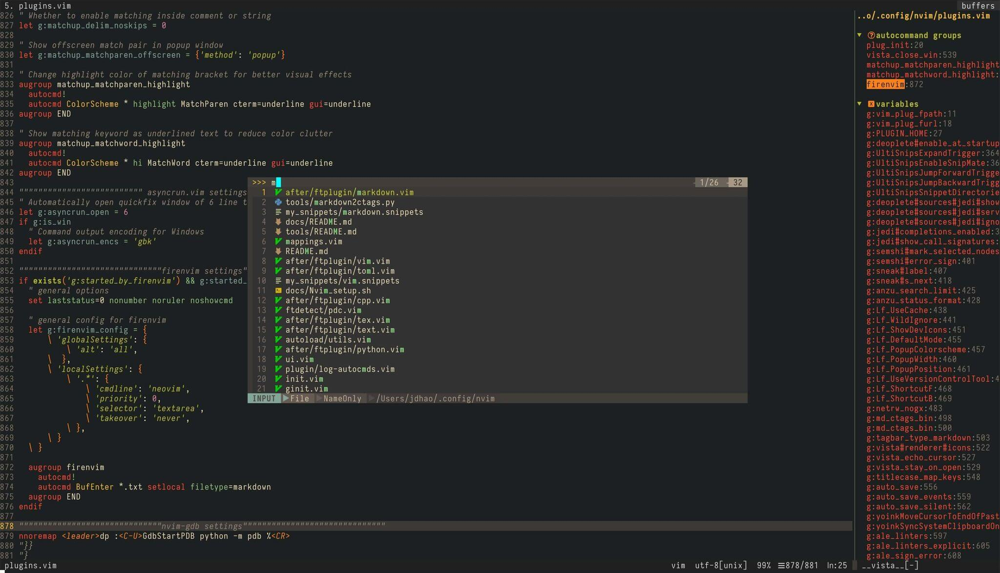

# Introduction

This is my Neovim configuration for all the platforms I use (Linux, Windows and
macOS). `init.vim` is the config file for terminal Neovim, and `ginit.vim` is
the additional config file for GUI client of Neovim (I am using
[neovim-qt](https://github.com/equalsraf/neovim-qt) for now on Windows).

My configurations are heavily documented to make it as clear as possible. While
you can download the whole repository and use it, it is not recommended though.
Good configurations are personal. Everyone should have his or her unique config
file. You are encouraged to copy from this this repo the part you feel useful
and add it to your own Nvim config.

See [doc here](docs/README.md) on how to install Nvim's dependencies, Nvim
itself and the configuration on different platforms (Linux, macOS and Windows).

# Features #

+ Auto-completion for Python via [Deoplete](https://github.com/Shougo/deoplete.nvim).
+ Source code linting via [Ale](https://github.com/dense-analysis/ale).
+ Code formatting via [Neoformat](https://github.com/sbdchd/neoformat).
+ Markdown writing and syntax highlighting via [vim-markdown](https://github.com/plasticboy/vim-markdown) and [vim-pandoc-syntax](https://github.com/vim-pandoc/vim-pandoc-syntax).
+ LaTeX editing via [vimtex](https://github.com/lervag/vimtex)[^1].
+ Git integration via [vim-fugitive](https://github.com/tpope/vim-fugitive).
+ Fast buffer jump via [vim-sneak](https://github.com/justinmk/vim-sneak).
+ Fuzzy searching in current project quickly via [LeaderF](https://github.com/Yggdroot/LeaderF).
+ Beautiful status line via [vim-airline](https://github.com/vim-airline/vim-airline).
+ Tags navigation via [tagbar](https://github.com/majutsushi/tagbar).
+ ......

# Shortcuts

In the following shortcuts, `<leader>` represents the `,` character.

| Shortcut          | Mode   | Description                                               |
|-------------------|--------|-----------------------------------------------------------|
| `<leader>f`       | Normal | Fuzzy file search in a floating window                    |
| `<leader><Space>` | Normal | Remove trailing whitespaces                               |
| `<leader>v`       | Normal | Reselect last pasted text                                 |
| `<leader>ev`      | Normal | Edit Neovim config in a new tabpage                       |
| `<leader>sv`      | Normal | Reload Neovim config                                      |
| `<leader>q`       | Normal | Quit current window                                       |
| `<leader>Q`       | Normal | Quit all window and close Neovim                          |
| `<leader>w`       | Normal | Save current buffer content                               |
| `<leader>cd`      | Normal | Change current directory to where current file is         |
| `<leader>y`       | Normal | Copy the content of entire buffer to default register     |
| `<leader>cl`      | Normal | Toggle cursor column                                      |
| `<Space>s`        | Normal | Toggle the sidebar (show project tree view)               |
| `<space>t`        | Normal | Toggle tag window (show project tags in the right window) |
| `<F11>`           | Normal | Toggle spell checking                                     |
| `<F12>`           | Normal | Toggle paste mode                                         |
| `\x`              | Normal | Close location or quickfix window                         |
| `\d`              | Normal | Close current buffer and go to previous buffer            |
| `ctrl-u`          | Insert | Turn word under cursor to upper case                      |
| `ctrl-t`          | Insert | Turn word under cursor to title case                      |
| `jk`              | Insert | Return to Normal mode (faster `<ESC>`)                    |

# Trouble shooting

If you come across an issue, you can first use `:checkhealth` command provided
by `nvim` to trouble-shoot yourself. Please read carefully the messages
provided by health check.

If you still have an issue, you may [open a new issue](https://github.com/jdhao/nvim-config/issues).

# Further readings

+ [Config nvim on Linux for Python development](https://jdhao.github.io/2018/12/24/centos_nvim_install_use_guide_en/)
+ [Nvim config on Windows 10](https://jdhao.github.io/2018/11/15/neovim_configuration_windows/)
+ [Nvim-qt config on Windows 10](https://jdhao.github.io/2019/01/17/nvim_qt_settings_on_windows/)

[^1]: Not enabled by default for Linux, see [this issue](https://github.com/jdhao/nvim-config/issues/4#issuecomment-617736636) on how to enable vimtex on Linux.
